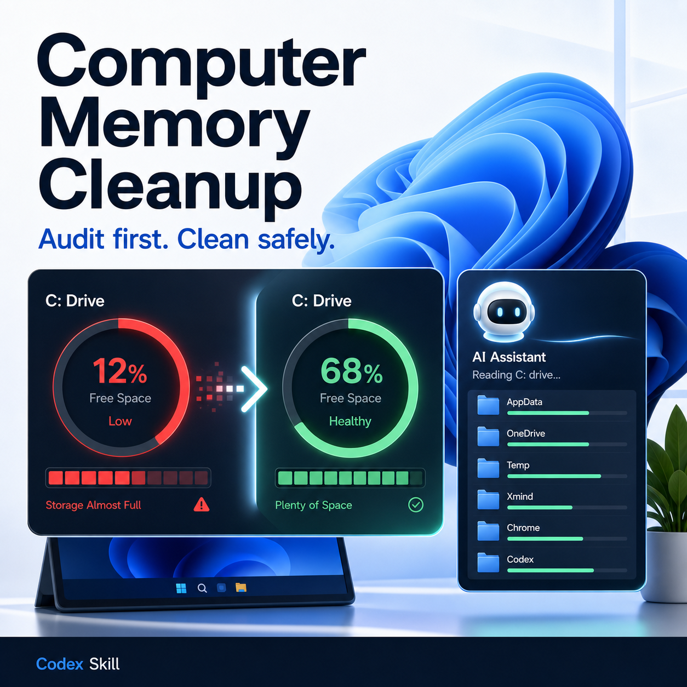
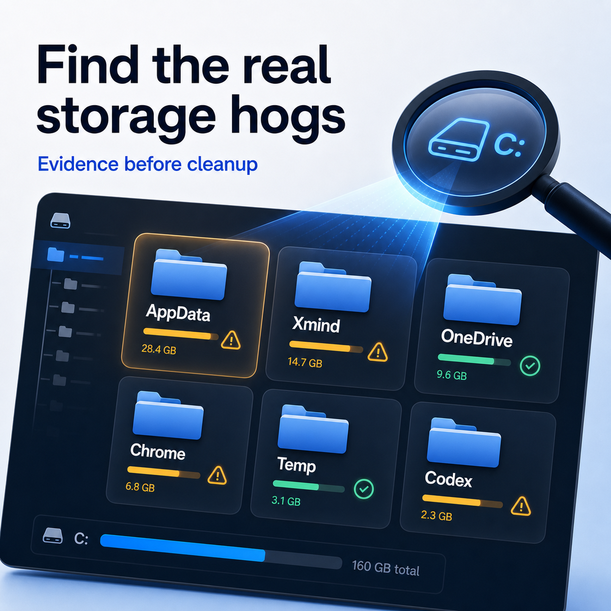
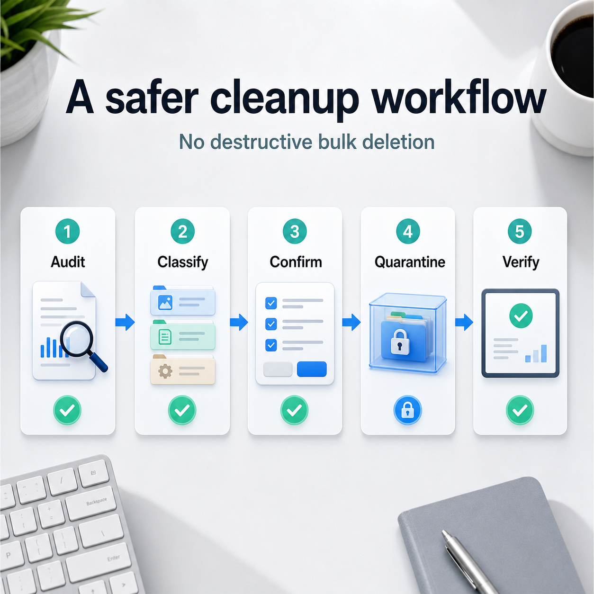

# Computer Memory Cleanup Skill · Windows C Drive Audit / Safe Cleanup Planning


> 中文版: [README.md](./README.md)

An agent skill for Codex and similar local coding-agent environments. It audits Windows C drive storage pressure, identifies the biggest contributors, and turns the evidence into a staged cleanup plan.

The skill is intentionally conservative. Its bundled script is read-only: it reports disk usage and cleanup guidance, but does not delete, move, compact, or release files. Actual cleanup actions require explicit user confirmation.

## Social media preview

These images can be used on GitHub, LinkedIn, X, newsletters, or project launch posts:

| Cover | Find storage hogs |
|-------|-------------------|
|  |  |

| Safer workflow | GitHub CTA |
|----------------|------------|
|  |  |

## 30-second start

Send this to a shell-capable Codex or local agent:

```text
Install the computer-memory-cleanup skill. Clone https://github.com/kiaarryy/Computer-memory-cleanup-skill, then copy the computer-memory-cleanup folder into $env:USERPROFILE\.codex\skills\computer-memory-cleanup. After installation, run quick_validate.py and run scripts\audit-c-drive.ps1 -Drive C: -TopN 10 as a read-only smoke test.
```

If already installed, update with:

```text
Update the computer-memory-cleanup skill. Run git pull in the local repository, sync the computer-memory-cleanup folder into $env:USERPROFILE\.codex\skills\computer-memory-cleanup, then run quick_validate.py.
```

After installation, say:

```text
Use $computer-memory-cleanup to audit my Windows C drive and propose a safe cleanup plan.
```

Try these requests:

```text
Audit why my C drive keeps filling up. Do not delete files; show evidence and a cleanup plan.
```

```text
Check whether Codex, Xmind, OneDrive, Chrome, or Temp is using the most space.
```

```text
Classify my largest C drive folders by safe-to-clean, app-managed cleanup, quarantine-only, and protected data.
```

## What it does

- Audits C/E drive free space, user profile folders, AppData, Codex, Xmind, OneDrive, Chrome/Google, Docker, and Temp.
- Reports candidate path sizes, top folders, path type, and safety guidance.
- Separates logical cloud-file size from actual reclaimable local disk space.
- Guides safe Xmind cache handling through app shutdown, path resolution, destination-space checks, dated quarantine, and verification.
- Guides OneDrive cleanup through Files On-Demand / Free up space / `attrib +U -P`, without deleting synced cloud files.
- Blocks risky habits such as recursive deletion, wildcard cleanup, deleting archives, or clearing project outputs.

## Good fit / Bad fit

Good fit:

- A Windows C drive is low on free space and the cause is unclear.
- AppData, Codex, IDEs, Xmind, OneDrive, browser caches, Docker, or Temp appear to be growing.
- The user wants an evidence-based cleanup plan with minimal risk.
- A one-off cleanup workflow should become reusable agent procedure.

Bad fit:

- One-click junk cleanup.
- Automatic cache deletion.
- Automatic deletion of OneDrive, Google Drive, or Dropbox files.
- Deciding which user documents, archives, or research outputs are safe to remove.

## Common scenarios

| Task | Recommended handling |
|------|----------------------|
| Low C drive free space | Run read-only audit first and rank top folders |
| Xmind cache is huge | Close Xmind and use quarantine move, not deletion |
| OneDrive folder is large | Use Files On-Demand to release local copies |
| Chrome/Google is large | Use app settings and preserve the user profile |
| Codex directory is growing | Inspect sessions/logs/cache; preserve skills and automations |
| Docker is large | List containers/images/volumes before any prune |
| Temp is growing | Prefer Storage Sense or a concrete stale-file list |

## Why not one-click cleanup

- Large files on C drive are often user data, cloud placeholders, app databases, research outputs, or archives.
- Deleting files inside OneDrive may delete them from the cloud.
- Clearing all of AppData can break login state, app settings, databases, and recent-file history.
- Safe cleanup needs an evidence chain: before space, target path, action type, after space, and rollback path.

## Platform support

| Platform | Status | Notes |
|----------|--------|-------|
| Codex | Supported | Recommended environment with local file and PowerShell access |
| Claude Code / Cursor | Usable | Requires Windows filesystem and shell access |
| Plain chatbot | Not recommended | No real local audit without filesystem access |
| macOS / Linux | Not primary | The safety model transfers, but scripts and paths are Windows-focused |

## Installation

### Option 1: Install into local Codex skills

```powershell
git clone https://github.com/kiaarryy/Computer-memory-cleanup-skill.git
Copy-Item -Recurse -LiteralPath .\Computer-memory-cleanup-skill\computer-memory-cleanup -Destination "$env:USERPROFILE\.codex\skills\computer-memory-cleanup"
```

Validate:

```powershell
$env:PYTHONUTF8=1
python "$env:USERPROFILE\.codex\skills\.system\skill-creator\scripts\quick_validate.py" "$env:USERPROFILE\.codex\skills\computer-memory-cleanup"
```

### Option 2: Run the audit script from the repository

```powershell
powershell -NoProfile -ExecutionPolicy Bypass -File .\computer-memory-cleanup\scripts\audit-c-drive.ps1 -Drive C: -TopN 15
```

### Option 3: Ask an agent to install it

> Install the `computer-memory-cleanup` Codex skill:
>
> 1. Clone `https://github.com/kiaarryy/Computer-memory-cleanup-skill.git`
> 2. Ensure `$env:USERPROFILE\.codex\skills` exists
> 3. Copy `computer-memory-cleanup` into `$env:USERPROFILE\.codex\skills\computer-memory-cleanup`
> 4. Run `quick_validate.py`
> 5. Run `audit-c-drive.ps1 -Drive C: -TopN 10` as a read-only smoke test

## Triggers

Use prompts like:

- `Use $computer-memory-cleanup to audit my Windows C drive and propose a safe cleanup plan.`
- `Check my C drive space without deleting files.`
- `Find the largest folders under AppData.`
- `Decide whether Xmind file-cache can be handled safely.`
- `Release OneDrive local copies without deleting cloud files.`
- `Check whether Codex local cache is why my C drive is full.`

## Workflow

The skill guides the agent through:

1. Read-only audit of disk free space, user profile, AppData, and candidate paths.
2. Evidence ranking by size and risk type.
3. Risk classification across app caches, cloud local copies, app state, user data, and quarantine candidates.
4. Cleanup planning starting from high-benefit, low-risk actions.
5. User confirmation before any move, release, or deletion.
6. Post-action verification of free space and path state.
7. Rollback awareness through quarantine for uncertain application caches.

See [computer-memory-cleanup/SKILL.md](./computer-memory-cleanup/SKILL.md) for the agent workflow.

## Safety model

| Type | Default strategy |
|------|------------------|
| Windows Temp | Prefer Storage Sense or a concrete stale-file list |
| Chrome / Google | Use app settings and preserve profiles |
| OneDrive / Google Drive | Release local copies; do not manually delete synced files |
| Xmind file-cache | Quarantine after user confirmation; delete later only after verification |
| Docker | List objects before pruning |
| `.codex` | Preserve sessions, skills, automations, and memories by default |
| User documents / outputs / archives | Protected by default |

## Example requests

```text
Run the computer-memory-cleanup read-only audit and show the largest 10 C drive and AppData folders.
```

```text
Xmind appears to use a lot of storage. Confirm process state, source path, and E drive capacity before proposing a quarantine move.
```

```text
Check whether OneDrive local copies can be released. Do not delete synced files; only use Files On-Demand style handling.
```

```text
Decide whether .codex is the main cause of my C drive growth. Audit only; do not prune sessions.
```

## Repository layout

```text
Computer-memory-cleanup/
|-- agent.md
|-- README.md
|-- README.en.md
|-- LICENSE
|-- .gitignore
`-- computer-memory-cleanup/
    |-- SKILL.md
    |-- agents/
    |   `-- openai.yaml
    `-- scripts/
        `-- audit-c-drive.ps1
```

## Core principles

1. Evidence before action.
2. Reversible handling before deletion.
3. App-managed cleanup before manual directory edits.
4. Cloud local-copy release before cloud-file deletion.
5. High-benefit, low-risk steps first.
6. Verification after every action.

## Roadmap

- Add optional JSON output for easier agent parsing.
- Add read-only helpers for Storage Sense, Docker, and browser cache diagnostics.
- Add an installer script while keeping cleanup actions disabled by default.
- Add more real before/after cleanup reports.

## FAQ

**Does this skill delete files?**

No. The bundled script is read-only. Any deletion, move, or local-copy release requires explicit user confirmation.

**Why can OneDrive show 24 GB but free only a few GB?**

OneDrive files may be cloud placeholders. Logical size is not the same as local disk usage.

**Can it automatically clean Xmind file-cache?**

Not by default. The recommended flow is to close Xmind, move the cache to a dated quarantine, verify Xmind, and only later remove the quarantine if safe.

**Can I delete `.codex\sessions` directly?**

Not by default. Sessions may contain useful history and diagnostics. Audit first and prune only if the user explicitly asks.

## License

MIT © 2026 Zhineng Jin
